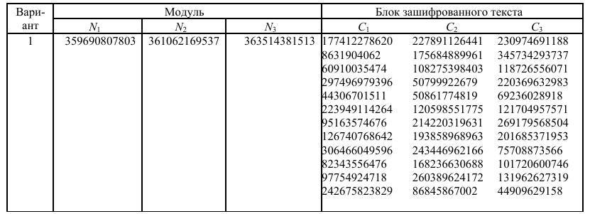
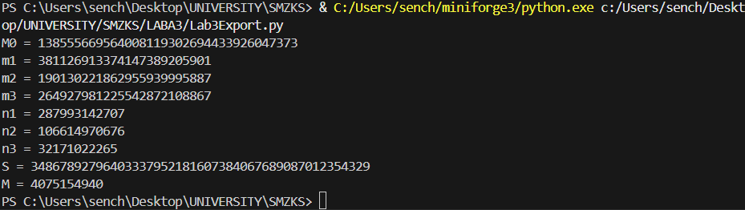

# Лабораторная работа № 3

## Тема
АТАКА НА АЛГОРИТМ ШИФРОВАНИЯ RSA ПОСРЕДСТВОМ МЕТОДА ФЕРМА

## Цель работы:
изучть атаку на алгоритм шифрования RSA посредством метода Ферма.

## Вариант №4

## Результаты работы

