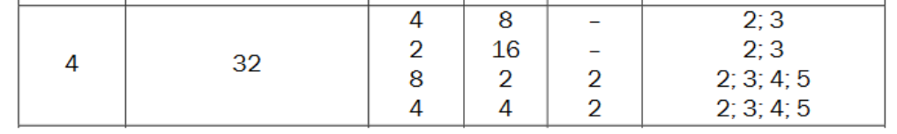
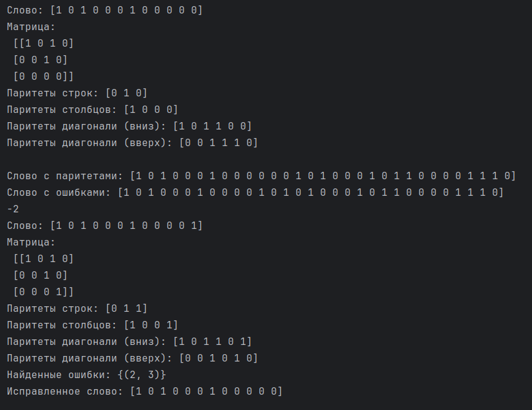
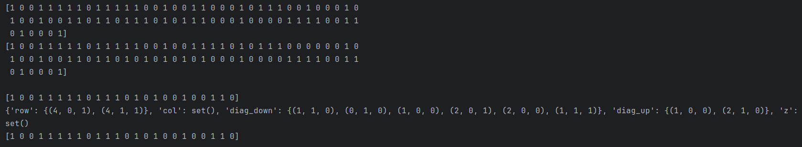

# Лабораторная работа № 2

## Тема
Избыточное кодирование данных в информационных системах. Итеративные коды

## Цель работы:
приобретение практических навыков кодирования/декодирования двоичных данных при использовании итеративных кодов.

## Вариант №4

## Результаты работы

