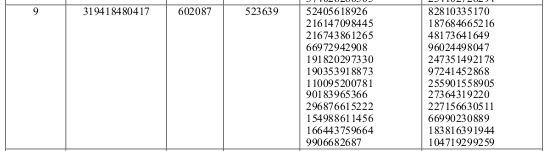
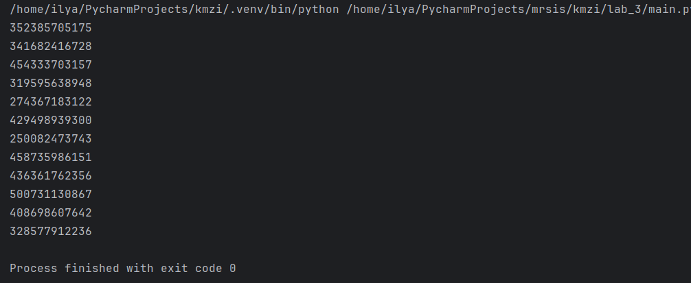

# Лабораторная работа № 3

## Тема
АТАКА НА АЛГОРИТМ ШИФРОВАНИЯ RSA, ОСНОВАННАЯ НА КИТАЙСКОЙ ТЕОРЕМЕ ОБ ОСТАТКАХ

## Цель работы:
Изучить атаку на алгоритм шифрования RSA посредством китайской теореме об остатках.

## Вариант №3

## Результаты работы

